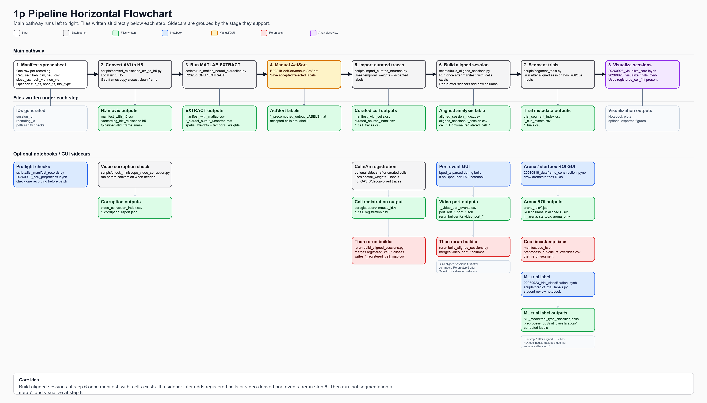

# Notebook-to-Pipeline Guide

Use the handmade spreadsheet as a manifest: one row equals one recording to process.
The notebook should become an inspection/reporting layer, while repeated steps live in
scripts.

## Active Pipeline Notebooks

- `20260919_neu_preprocess.ipynb`: one-recording neural checks, AVI-to-H5,
  EXTRACT/ActSort handoff, curated neuron import, and optional CaImAn
  registration.
- `20260919_dataframe_construction.ipynb`: one-recording dataframe build,
  arena ROI collection, cue timestamp overrides, boundary tuning setup, and
  trial segmentation.
- `20260923_visualize_core.ipynb`: inspect full-session arena behavior with
  arena/startbox ROIs, head direction, and optional neural maps such as 2D
  ratemap, HD, EBC, and cell summary plots.
- `20260923_visualize_trials.ipynb`: inspect individual trials, Bpod or
  video-port event timing, success/unsuccess definitions, trajectory labels,
  trial metrics, and optional neural traces aligned to trial/cue/port events.
- `20260923_trial_classification.ipynb`: label trajectory trials, train sklearn
  trial-type classifiers, predict unlabeled trials, and review/correct model
  predictions.
- `20260923_trial_prediction_review.ipynb`: student-facing review notebook for
  labels predicted by a saved model from `ML_model/`.
- `20260923_port_signal_extraction.ipynb`: fallback for recordings with no Bpod
  byte file; draw a behavior-video port ROI, extract the pixel-intensity signal,
  tune on/off detection, verify start/stop frames, and save video-derived port
  events.

## Manifest Columns

Recommended columns:

- `date`: recording date.
- `mouse_id`: optional when each Excel sheet is already one mouse.
- `beh_csv`: behavior timestamp CSV.
- `neu_csv`: miniscope/neural timestamp CSV.
- `sleap_csv`: SLEAP output CSV for the behavior video.
- `beh_vid`: behavior camera AVI.
- `neu_vid`: miniscope AVI to convert to H5.
- `trial_type`: optional label such as `FE1_Sal`.
- `cue_ts`: optional cue timestamp file or note.
- `bpod_ts`: optional Bpod byte/event timestamp CSV. Headerless rows like
  `...,2026-07-22T15:14:41.7699200-07:00,1` are supported; byte `1` means
  port 1 on, byte `11` means port 1 off, byte `2` means port 2 on, byte `12`
  means port 2 off, and the same `+10` off-code pattern is used for all four
  ports.
- `video_port_events_csv`: optional video-derived port event CSV for recordings
  without Bpod bytes. This can be created by
  `20260923_port_signal_extraction.ipynb`; if absent, dataframe construction
  also checks the default per-recording behavior output path.
- `neu_h5`: produced by video conversion.
- `matlab_output_dir`: produced by MATLAB extraction.
- `cell_csv`: produced by curated neuron import.

Older names such as `beh_csv_path`, `neu_csv_path`, `sleap_csv_path`,
`bpod_csv`, `port_events_csv`, `beh_vid_path`, and `miniscope_video` are
normalized automatically.

Two IDs are created automatically:

- `session_id`: day-level ID, usually `mouse_id_YYYYMMDD`.
- `recording_id`: row-level ID. If one date has multiple recordings, this adds
  `trial_type` or a video-derived suffix so files do not overwrite each other.

## Pipeline Flowchart

Open or embed the rendered visual chart:



Legend:

- Blue: notebook-friendly single-recording checks or review.
- Gray: batch scripts.
- Yellow: manual/GUI intervention.
- Green: files written under `preprocess_out/`.
- Red: rerun point after a manual/optional sidecar changes.

```mermaid
flowchart LR
    M["Manifest spreadsheet<br/>data_paths/*.xlsx or *.csv"]:::input

    M --> LIST["scripts/list_manifest_records.py<br/>check recording_id values and paths"]:::script
    M --> PRENB["20260919_neu_preprocess.ipynb<br/>single recording video/H5/MATLAB checks"]:::notebook
    M --> VIDCHK["scripts/check_miniscope_video_corruption.py<br/>optional leading-frame corruption report"]:::script
    VIDCHK --> VIDCHKOUT["preprocess_out/video_corruption_index.csv<br/>preprocess_out/&lt;recording_id&gt;/neural/*_corruption_report.json"]:::output

    M --> AVI2H5["scripts/convert_miniscope_avi_to_h5.py<br/>AVI to local uint8 H5"]:::script
    PRENB --> AVI2H5
    VIDCHKOUT --> AVI2H5
    AVI2H5 --> H5OUT["preprocess_out/manifest_with_h5.csv<br/>preprocess_out/&lt;recording_id&gt;/neural/&lt;recording_id&gt;_miniscope.h5"]:::output

    H5OUT --> MATLAB["scripts/run_matlab_neural_extraction.py<br/>or matlab/run_extract_batch_from_index.m"]:::script
    MATLAB --> EXTRACTOUT["preprocess_out/manifest_with_matlab.csv<br/>preprocess_out/&lt;recording_id&gt;/matlab/*_extract_output_unsorted.mat"]:::output
    EXTRACTOUT --> ACTSORT["ActSort/manualActSort in MATLAB R2021b<br/>manual accepted/rejected cell labels"]:::gui
    ACTSORT --> LABELS["preprocess_out/&lt;recording_id&gt;/matlab/*_precomputed_output_LABELS.mat"]:::output
    EXTRACTOUT --> IMPORT["scripts/import_curated_neurons.py<br/>EXTRACT temporal_weights + accepted labels"]:::script
    LABELS --> IMPORT
    IMPORT --> CELLS["preprocess_out/manifest_with_cells.csv<br/>preprocess_out/curated_neuron_index.csv<br/>preprocess_out/&lt;recording_id&gt;/neural/*_cell_traces.csv"]:::output

    CELLS --> BUILD["scripts/build_aligned_sessions.py<br/>build behavior/SLEAP/Bpod/video-port/neural table"]:::script
    M --> BUILD
    BUILD --> ALIGNED["preprocess_out/aligned_session_index.csv<br/>preprocess_out/aligned_sessions/&lt;recording_id&gt;_session.csv"]:::output

    EXTRACTOUT --> COREG["scripts/register_cells_across_sessions.py<br/>CaImAn uses spatial_weights + labels<br/>not OASIS/deconvolved traces"]:::script
    LABELS --> COREG
    CELLS --> COREG
    COREG --> COREGOUT["preprocess_out/coregistration_index.csv<br/>preprocess_out/coregistration/&lt;mouse_id&gt;/&lt;mouse_id&gt;_cell_registration.csv"]:::output
    COREGOUT --> RERUNCOREG["RERUN scripts/build_aligned_sessions.py<br/>merges registered IDs into analysis table"]:::rerun
    RERUNCOREG --> ALIGNEDREG["updated aligned session CSV<br/>keeps local cell_* and adds registered_cell_*"]:::output
    ALIGNEDREG --> ALIGNED
    RERUNCOREG --> REGMAP["preprocess_out/&lt;recording_id&gt;/neural/&lt;recording_id&gt;_registered_cell_map.csv"]:::output

    M --> BPOD["bpod_ts column present<br/>Bpod bytes/port states"]:::input
    BPOD --> BUILD
    M --> PORTNB["Port event GUI<br/>20260923_port_signal_extraction.ipynb<br/>draw port ROI and verify on/off frames"]:::notebook
    PORTNB --> PORTOUT["preprocess_out/&lt;recording_id&gt;/behavior/*_video_port_events.csv<br/>port_rois/&lt;recording_id&gt;__port_*.json"]:::output
    PORTOUT --> RERUNPORT["RERUN scripts/build_aligned_sessions.py<br/>adds video_port_* active/event columns"]:::rerun
    RERUNPORT --> ALIGNED

    ALIGNED --> ARENANB["20260919_dataframe_construction.ipynb<br/>arena/startbox ROI GUI and one-recording checks"]:::notebook
    ARENANB --> ALIGNEDROI["Arena ROI outputs<br/>arena_rois/*.json<br/>aligned CSV ROI columns"]:::output
    ALIGNEDROI --> SEG["scripts/segment_trials.py<br/>cue events and trial table"]:::script
    ALIGNED --> SEG
    M --> CUEFIX["cue_ts column or preprocess_out/cue_ts_overrides.csv<br/>manual cue timestamp fixes"]:::input
    CUEFIX --> RERUNCUE["RERUN build_aligned_sessions.py if manifest cue_ts changed<br/>RERUN segment_trials.py after any cue fix"]:::rerun
    RERUNCUE --> BUILD
    RERUNCUE --> SEG
    SEG --> TRIALS["preprocess_out/trial_segment_index.csv<br/>preprocess_out/&lt;recording_id&gt;/behavior/*_cue_events.csv<br/>preprocess_out/&lt;recording_id&gt;/behavior/*_trials.csv"]:::output

    ALIGNED --> VISCORE["20260923_visualize_core.ipynb<br/>full-session behavior and optional neural plots"]:::notebook
    TRIALS --> VISTRIALS["20260923_visualize_trials.ipynb<br/>trial metrics, event timing, optional neural traces"]:::notebook
    ALIGNED --> VISTRIALS

    TRIALS --> CLASSNB["ML trial label<br/>20260923_trial_classification.ipynb<br/>label trials and train sklearn model"]:::notebook
    CLASSNB --> MODEL["ML trial label outputs<br/>ML_model/trial_type_classifier.joblib<br/>preprocess_out/trial_classification/*"]:::output
    MODEL --> PREDICT["scripts/predict_trial_labels.py<br/>apply saved model"]:::script
    PREDICT --> REVIEW["20260923_trial_prediction_review.ipynb<br/>student correction/review loop"]:::notebook

    classDef input fill:#ffffff,stroke:#71717a,color:#18181b;
    classDef script fill:#f4f4f5,stroke:#52525b,color:#18181b;
    classDef notebook fill:#dbeafe,stroke:#2563eb,color:#172554;
    classDef gui fill:#fef3c7,stroke:#d97706,color:#451a03;
    classDef output fill:#dcfce7,stroke:#16a34a,color:#052e16;
    classDef rerun fill:#fee2e2,stroke:#dc2626,color:#450a0a;
```



## Batch Flow

Set your lab mount if the spreadsheet stores paths like `\Data\May\...`:

```bash
export LAB_DRIVE_PATH=/Volumes/ASA_Lab
```

On a Windows GPU PC, use the mapped lab drive instead, for example
`--lab-drive Z:\` or set `LAB_DRIVE_PATH=Z:\` in that shell.
If the notebook shows a video path like `Data\May\...`, that is still missing
the drive/root. Set `LAB_DRIVE = "Z:/"` in the notebook config cell if the full
path is `Z:\Data\May\...`, or `LAB_DRIVE = "C:/"` if the full path is
`C:\Data\May\...`.

Convert miniscope AVI files into H5:

```bash
python scripts/convert_miniscope_avi_to_h5.py data_paths/RSC_PPC_Cohort1_paths.xlsx \
  --output-root preprocess_out
```

New H5 movies are written as `uint8` by default. EXTRACT's MATLAB
`preprocess_save` reads H5 chunks and converts them to `single` internally, so
the input H5 does not need to be stored as float32. If you want smaller local
scratch files while converting, add fast HDF5 compression:

```bash
python scripts/convert_miniscope_avi_to_h5.py data_paths/RSC_PPC_Cohort1_paths.xlsx \
  --output-root preprocess_out \
  --compression lzf
```

Optional preflight: check which videos have bad leading frames before converting:

```bash
python scripts/check_miniscope_video_corruption.py data_paths/RSC_PPC_Cohort1_paths.xlsx \
  --output-root preprocess_out
```

This reads the source `neu_vid` from the spreadsheet or lab drive, but writes the
input H5 locally by default:

```text
preprocess_out/<recording_id>/neural/<recording_id>_miniscope.h5
```

The converter keeps the original neural frame indexing. If the AVI begins with
corrupt metadata or striated frames, those positions become gap frames in the H5
rather than being removed. By default, each leading gap frame is filled with a
copy of the first clean frame, so frame count and shape stay stable for EXTRACT
without preserving the corrupt image content. The H5 also contains:

```text
/pipeline/valid_frame_mask
```

where `0` means a gap placeholder and `1` means a real decoded frame. This keeps
H5 frame `n` aligned with neural timestamp row `n`.

If a spreadsheet already has a `neu_h5` column, it is ignored unless you pass
`--use-manifest-h5`.

Older converted H5 files may have `/valid_frame_mask` at the H5 root. EXTRACT's
`preprocess_save` expects only the movie dataset at the root, so repair those H5
files before MATLAB extraction:

```bash
python scripts/repair_miniscope_h5_for_extract.py preprocess_out/manifest_with_h5.csv \
  --output-root preprocess_out \
  --use-manifest-h5
```

Run MATLAB extraction over the H5 files:

```bash
python scripts/run_matlab_neural_extraction.py preprocess_out/manifest_with_h5.csv \
  --matlab-script matlab/run_extract_template.m \
  --matlab-bin "C:\Program Files\MATLAB\R2025b\bin\matlab.exe" \
  --output-root preprocess_out \
  --extra extract_use_gpu=1 \
  --extra extract_gpu_forward_compatibility=1
```

The MATLAB runner also defaults to that local H5 path under `--output-root`.
The template enables MATLAB CUDA forward compatibility when GPU extraction is
enabled, because that setting is not persistent between MATLAB sessions.
The template calls `matlab/run_extract_one_record.m`, which wraps:

1. `preprocess_save("<recording>.h5:/data", config)`
2. `extractor({"<recording>_final.h5", "/data"}, config)`
3. saving `<recording_id>_extract_output_unsorted.mat` for Python import and
   as the source for ActSort/manualActSort curation

If you prefer to loop inside MATLAB on the GPU PC, open MATLAB from the repo root
and run one recording first:

```matlab
addpath('matlab')
run_extract_batch_from_index( ...
    'preprocess_out/manifest_with_h5.csv', ...
    'preprocess_out', ...
    'Only', 'RECORDING_ID', ...
    'GpuForwardCompatibility', 1);
```

Then run all rows:

```matlab
addpath('matlab')
run_extract_batch_from_index( ...
    'preprocess_out/manifest_with_h5.csv', ...
    'preprocess_out', ...
    'GpuForwardCompatibility', 1);
```

Both routes write MATLAB outputs under:

```text
preprocess_out/<recording_id>/matlab/
```

Use your MATLAB versions as two separate stages:

1. **R2025b**: run EXTRACT/GPU preprocessing and extraction.
2. **R2021b**: open ActSort/manualActSort and curate the saved unsorted output.

The EXTRACT stage saves the raw unsorted EXTRACT output for each recording:

- `<recording_id>_extract_output_unsorted.mat`: unsorted EXTRACT output with an
  `output` variable for Python import and as the source for
  ActSort/manualActSort curation.

Then do the manual curation checkpoint in MATLAB:

1. Run Schnitzer lab EXTRACT-public for each H5 in R2025b.
2. Open R2021b.
3. Use ActSort/manualActSort's normal load/precompute workflow starting from the
   unsorted EXTRACT output.
4. Manually classify accepted cells and rejected components.
5. Save labels as `<recording_id>_precomputed_output_LABELS.mat` in that
   recording's MATLAB output directory.

ActSort may also create `<recording_id>_precomputed_output.mat`. That file is
fine when ActSort creates it; the Python pipeline no longer creates a fake
`precomputedOutput` helper file before curation.

Import curated neurons from MATLAB/EXTRACT outputs:

```bash
python scripts/import_curated_neurons.py preprocess_out/manifest_with_matlab.csv \
  --trace-kind raw \
  --output-root preprocess_out
```

Optional: register accepted neurons across sessions for one mouse with CaImAn.
This step uses EXTRACT spatial footprints plus ActSort labels. It is a sidecar
analysis output, not a requirement for database/dataframe formation.

```bash
python scripts/register_cells_across_sessions.py preprocess_out/manifest_with_cells.csv \
  --output-root preprocess_out \
  --only C57-3-1-A
```

Run this from a CaImAn environment. If CaImAn is not installed, the script skips
registration by default and writes `preprocess_out/coregistration_index.csv`
with `status=skipped_missing_caiman`; the next dataframe step can still run.
Use `--require-caiman` when you want a missing CaImAn install to fail loudly.
For example, from the repo folder on the GPU PC:

```bash
conda activate caiman
python scripts/register_cells_across_sessions.py preprocess_out/manifest_with_cells.csv \
  --output-root preprocess_out \
  --only C57-3-1-A
```

The registration table is written here:

```text
preprocess_out/coregistration/<mouse_id>/<mouse_id>_cell_registration.csv
```

It maps each session-local EXTRACT/ActSort footprint to a cross-session
identity. This is not built from OASIS/deconvolved traces; CaImAn receives the
accepted EXTRACT spatial footprints as a `pixels x cells` matrix and returns the
cross-session assignment table.

```text
mouse_id, registered_cell_id, recording_id, session_id, component_idx, cell_col
```

After that file exists, **rerun `scripts/build_aligned_sessions.py` for the
affected recordings or mouse**. The aligned CSV keeps the local EXTRACT/ActSort
columns such as `cell_17` and adds cross-session aliases such as
`registered_cell_0` when a mapping is available. Nothing is overwritten, so the
same aligned file can be used for local-cell analyses or registered-cell
analyses.

The builder also writes a per-recording map:

```text
preprocess_out/<recording_id>/neural/<recording_id>_registered_cell_map.csv
```

`aligned_session_index.csv` reports:

```text
cell_registration_csv, registered_cell_map_csv,
n_registered_cell_links, n_registered_cell_aliases, registered_cell_status
```

Use `--no-registered-cell-aliases` on `build_aligned_sessions.py` if you want to
ignore CaImAn outputs and build only local `cell_*` columns.

Build aligned behavior, SLEAP, optional Bpod, and optional neural CSVs:

```bash
python scripts/build_aligned_sessions.py preprocess_out/manifest_with_cells.csv \
  --output-root preprocess_out
```

Run this once after `manifest_with_cells.csv` exists. Rerun this same builder
after sidecars add new columns or files, especially after CaImAn registration or
video-derived port extraction.

If the CaImAn registration CSV exists for that mouse, this stage automatically
adds `registered_cell_*` alias columns to:

```text
preprocess_out/aligned_sessions/<recording_id>_session.csv
```

Open `20260919_dataframe_construction.ipynb` and run the **Collect or Load
Arena ROIs** section for each recording before trial segmentation. The OpenCV
GUI saves:

```text
arena_rois/<recording_id>__arena.json
arena_rois/<recording_id>__startbox_L.json
arena_rois/<recording_id>__startbox_R.json
```

That notebook adds these columns to the aligned session CSV:

```text
in_arena, in_startbox_L, in_startbox_R, arena_only
```

If `bpod_ts` is present, aligned session CSVs also get Bpod event columns such
as `bpod_code`, `bpod_port`, `bpod_state`, `bpod_event_dropped`, and
`bpod_port_<n>_active` columns for whichever ports appear in the file. The same
stage writes lossless behavior-side Bpod tables:

```text
preprocess_out/<recording_id>/behavior/<recording_id>_bpod_events.csv
preprocess_out/<recording_id>/behavior/<recording_id>_bpod_intervals.csv
```

`bpod_events.csv` has one row per byte/event. `bpod_intervals.csv` pairs port-on
and port-off rows and reports each port activation duration.

For recordings without Bpod bytes, open `20260923_port_signal_extraction.ipynb`
before the final dataframe build. For each port, the notebook saves:

```text
port_rois/<recording_id>__port_<n>.json
preprocess_out/<recording_id>/behavior/<recording_id>_port_<n>_port_signal.csv
preprocess_out/<recording_id>/behavior/<recording_id>_port_<n>_port_events_from_video.csv
```

It also updates the combined handoff file:

```text
preprocess_out/<recording_id>/behavior/<recording_id>_video_port_events.csv
```

**After saving video-derived port events, rerun
`scripts/build_aligned_sessions.py --only RECORDING_ID`.** The aligned session
CSV then gets video-derived columns such as:

```text
video_port_1_active, video_any_port_active, video_port_event_idx,
video_port_name, video_port_state, video_port_events_path
```

`aligned_session_index.csv` also reports `video_port_events_csv` and
`n_video_port_events` for these recordings.

`20260923_visualize_core.ipynb` can also collect/load those same ROI files for
plotting full-session behavior and optional neural maps. It uses ROI features in
memory by default and only writes them back to the aligned CSV if
`SAVE_ROI_FEATURES_TO_ALIGNED_CSV = True`.

Use `20260923_visualize_trials.ipynb` after trial segmentation when you want to
compare trial trajectories, count correct/incorrect trials, inspect active port
onsets, or align optional neural traces to cue, trial, or port-event times.

Segment trials and save cue/trial metadata:

```bash
python scripts/segment_trials.py preprocess_out/manifest_with_cells.csv \
  --output-root preprocess_out
```

If cue timestamps are cue onsets with a fixed duration, pass that duration:

```bash
python scripts/segment_trials.py preprocess_out/manifest_with_cells.csv \
  --output-root preprocess_out \
  --cue-duration-s 5
```

This writes one cue-event table and one trial table per recording:

```text
preprocess_out/<recording_id>/behavior/<recording_id>_cue_events.csv
preprocess_out/<recording_id>/behavior/<recording_id>_trials.csv
```

Open `20260923_trial_classification.ipynb` after trial segmentation when you
want to label a subset of trajectory trials, train sklearn trial-type
classifiers, predict the remaining trial labels, and review/correct predictions.
It writes labels and predictions under:

```text
preprocess_out/trial_classification/
```

The trained model bundle is saved here:

```text
ML_model/trial_type_classifier.joblib
```

To apply that saved model to fully processed recordings without retraining, run:

```bash
python scripts/predict_trial_labels.py \
  --output-root preprocess_out \
  --model ML_model/trial_type_classifier.joblib
```

This writes:

```text
preprocess_out/trial_classification/saved_model_trial_predictions.csv
preprocess_out/trial_classification/saved_model_prediction_index.csv
```

Then open `20260923_trial_prediction_review.ipynb`. Students can inspect the
trial trajectory plot plus predicted label/confidence, accept the prediction, or
save a corrected label. Accepted/corrected labels are written back to
`preprocess_out/trial_classification/trial_labels.csv`, and the review actions
are logged in:

```text
preprocess_out/trial_classification/saved_model_review_log.csv
```

Cue metadata can contain one or more W/A/S/D entries with UTC timestamps, such
as:

```text
W 2026-08-07T19:21:03.123Z; A 2026-08-07T19:21:09.500Z
```

The cue-event table includes:

```text
cue_event_idx, cue_key, cue_start_utc, cue_end_utc, cue_duration_s,
cue_start_frame, cue_end_frame, cue_start_global_idx, cue_end_global_idx
```

The trial table includes:

```text
recording_id, session_id, mouse_id, trial_idx, start_frame, end_frame,
start_side, end_side, trial_type, cue_ts, cue_ts_source, cue_ts_note,
cue_key, cue_start_utc, cue_end_utc, cue_start_frame, cue_end_frame
```

If a cue timestamp needs a manual fix, add or edit a row in:

```text
preprocess_out/cue_ts_overrides.csv
```

with columns:

```text
recording_id,cue_ts,cue_ts_note
```

The override only changes the trial metadata output. The original spreadsheet
and aligned session CSV remain unchanged.

If you fix cue timestamps directly in the manifest spreadsheet, **rerun
`scripts/build_aligned_sessions.py --only RECORDING_ID`** so the aligned session
CSV stores the updated `cue_ts`, then rerun `scripts/segment_trials.py --only
RECORDING_ID`. If you use `preprocess_out/cue_ts_overrides.csv` instead, **rerun
`scripts/segment_trials.py --only RECORDING_ID`**; rebuilding the aligned
session CSV is optional because the override is applied during trial
segmentation.

Each stage writes an index CSV in `preprocess_out/` and a generated manifest for the
next stage. You can rerun one recording with `--only RECORDING_ID`.

## Check One Video Before Batch

Use this loop on a new machine before running a full spreadsheet batch.

First list the `recording_id` values generated from the spreadsheet:

```bash
python scripts/list_manifest_records.py data_paths/RSC_PPC_Cohort1_paths.xlsx \
  --lab-drive /Volumes/ASA_Lab \
  --show-paths \
  --check-files
```

Pick one `recording_id` from the table. Then run the corruption checker for only
that recording:

```bash
python scripts/check_miniscope_video_corruption.py data_paths/RSC_PPC_Cohort1_paths.xlsx \
  --lab-drive /Volumes/ASA_Lab \
  --output-root preprocess_out \
  --only RECORDING_ID
```

This writes:

```text
preprocess_out/video_corruption_index.csv
preprocess_out/<recording_id>/neural/<recording_id>_miniscope_corruption_report.json
```

Read the index row first:

- `clean`: no leading gap frames were detected.
- `leading_corruption_found`: the converter will fill the leading bad frames
  with a copy of the first clean frame.
- `metadata_warnings_only`: frame images looked usable, but AVI metadata had a
  warning such as missing FPS or dimensions.
- `no_clean_run_found`: do not batch this video yet. Inspect it manually or
  increase `--corruption-probe-frames`.

Then convert just that one recording:

```bash
python scripts/convert_miniscope_avi_to_h5.py data_paths/RSC_PPC_Cohort1_paths.xlsx \
  --lab-drive /Volumes/ASA_Lab \
  --output-root preprocess_out \
  --only RECORDING_ID \
  --overwrite
```

If you know the first `N` frames are bad and want to override the detector, use:

```bash
python scripts/convert_miniscope_avi_to_h5.py data_paths/RSC_PPC_Cohort1_paths.xlsx \
  --lab-drive /Volumes/ASA_Lab \
  --output-root preprocess_out \
  --only RECORDING_ID \
  --manual-gap-leading-frames N \
  --overwrite
```

Quickly inspect the generated H5:

```bash
python - <<'PY'
import h5py

h5_path = "preprocess_out/RECORDING_ID/neural/RECORDING_ID_miniscope.h5"
with h5py.File(h5_path, "r") as f:
    print("data shape:", f["data"].shape)
    print("data dtype:", f["data"].dtype)
    print("valid mask shape:", f["pipeline"]["valid_frame_mask"].shape)
    print("gapped leading frames:", f.attrs["gapped_leading_frames"])
    print("valid frames:", f.attrs["valid_frame_count"])
PY
```

The important check is that `data.shape[0]` still matches the original neural
frame count. Gap frames are copied-frame placeholders, not removed frames, so
H5 frame `n` still lines up with neural timestamp row `n`.

## Post-EXTRACT Storage

For storage cleanup, treat both the converted miniscope H5 and MATLAB's
`*_miniscope_final.h5` as local scratch files. After EXTRACT/ActSort outputs are
verified, keep the MAT/CSV/JSON outputs and either delete the scratch H5 files or
archive them separately. If you must keep H5s on the server, compress after
EXTRACT with an HDF5 repacking tool, for example:

```bash
h5repack -f GZIP=4 input_miniscope.h5 input_miniscope_gzip.h5
```

This takes time and needs enough temporary disk space for the original and
compressed copy. In most runs, the server AVI plus manifest settings are the
source of truth, and the H5 files can be regenerated.

## MATLAB Contract

The Python runner calls MATLAB with these workspace variables:

- `recording_id`
- `session_id`
- `neu_h5_path`
- `output_dir`

The MATLAB stage uses Schnitzer lab EXTRACT-public plus ActSort/manualActSort.
This is intentionally not fully automatic, because the ActSort component labels
are a manual curation result.

For each `recording_id`, save:

- `<recording_id>_extract_output_unsorted.mat`
- `<recording_id>_precomputed_output_LABELS.mat`

The first file should contain EXTRACT's raw `output` structure. The second file
should contain ActSort/manual labels with `labels.labels_overall`, where
accepted cells are label `1`. If ActSort creates its own
`*_precomputed_output.mat` file for the GUI, keep it as an ActSort-side working
file; Python imports traces from the raw EXTRACT output plus labels from
`*_precomputed_output_LABELS.mat`. The alternate `*_actsort_LABELS.mat` name is
accepted only as a compatibility fallback.

If your MATLAB script writes a different prefix, add `extract_output_mat` and
`extract_labels_mat` columns to the manifest, or adapt the template.

## Notebook Refactor Pattern

For each notebook cell that performs a repeated calculation:

1. Move the calculation into a function in `preprocess_functions/`.
2. Keep plotting/inspection in the notebook.
3. Add a script that loads `SessionRecord` rows from the manifest and calls the
   function for each row.
4. Write outputs under `preprocess_out/<recording_id>/...`.
5. Write a small index CSV so the next stage can resume without guessing paths.

The existing helpers already follow this for alignment, pose, ROI features,
segmentation, and boundary tuning. The new batch layer adds the missing video,
MATLAB, and curated-neuron handoff stages.

## Plot Function Names

Use the notebook for visual checks, but call plot functions by plot type:

- `plot.plot_trajectory(...)`: trajectory over the behavior video frame.
- `plot.plot_hd_trajectory(...)`: trajectory with head-direction arrows.
- `plot.plot_2d_ratemap(...)`: occupancy-normalized 2D activity map for one cell.
- `plot.plot_hd(...)` or `plot.plot_hd_tuning(...)`: head-direction tuning for one cell.
- `plot.plot_ebc(...)`: egocentric boundary-cell polar map for one cell.
- `plot.plot_ebc_heatmap(...)`: EBC angle-by-distance heatmap.
- `plot.plot_ebc_occupancy(...)`: EBC occupancy/coverage check.
- `plot.plot_cell_summary(...)`: multi-panel trajectory, trace, 2D ratemap,
  EBC, and HD summary for one cell.

Older names such as `plot_trajectory_over_arena`,
`plot_head_direction_over_arena`, and `plot_trajectory_coverage_with_cell` still
work, so old notebooks can be migrated one cell at a time.
